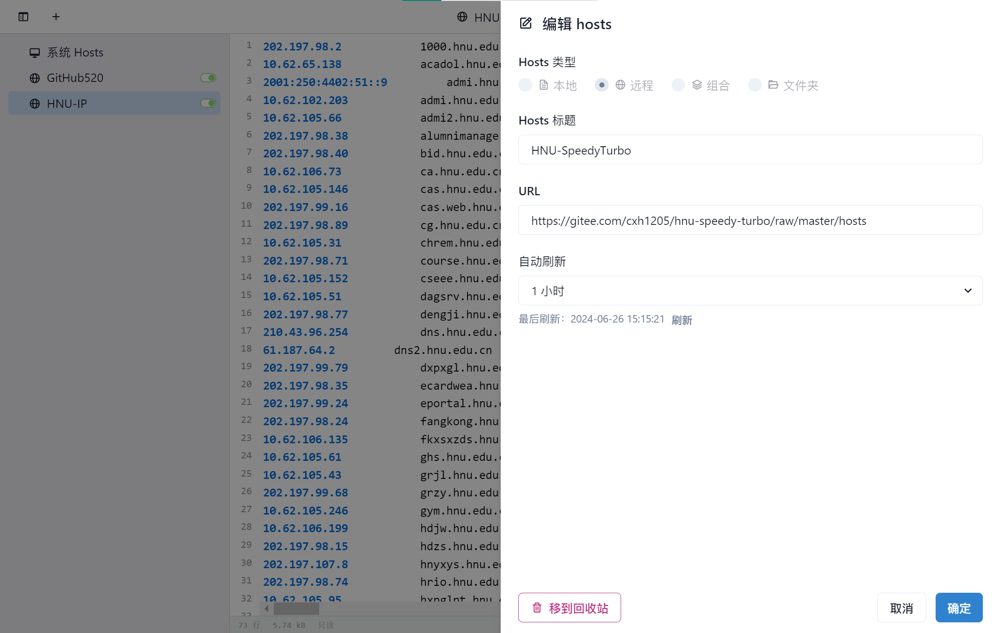

# HNU-SpeedyTurbo🚀

<a href="README.zh-CN.md">简体中文</a>|<a href="README.en.md">English</a>

解决HNU的🌐有线或无线连接下，浏览器提示“🤷‍♀️找不到example.com的IP地址”的现象

## 一、介绍

本项目部署在一台可连接**湖南大学校园网**（**HNU**）的服务器🖥︎上，会定期检查更新并生成`hosts`文件📄上传，更改本地设备的**DNS服务器**和`hosts`文件📄后，可解决HNU的域名解析难和慢问题，并在一定程度上提高🚀网页加载速度，但是一定要⚠️注意[适用范围](#二适用范围)

有类似的需求也可基于本项目做**非商业化**的拓展，比如其他高校的连接加速（参考[自定义方法](#四自定义方法)）

开发目的：连接到HNU后，设备通常会自动使用HNU提供的一个**DNS解析服务**，但是这个DNS解析服务器经常抽风，导致解析诸如B站、CSDN这些域名非常慢，甚至无法解析，而手动更换DNS服务器后又会导致无法享受到校园内网的资源，像个人门户之类的内网网站会自动跳转webvpn。因此采用这个折衷的办法，采用公共DNS服务器，但是在`hosts`中指定xxx.hnu.edu.cn的IP地址，来实现享受快速解析的过程中享受便利的校园资源。

校内外DNS解析地址对比（2024年6月26日更新）：

|                            | 119.29.29.29（腾讯DNSPod）            | 202.197.96.1（HNU默认首选DNS）                    |
| -------------------------- | ------------------------------------- | ------------------------------------------------- |
| 个人门户（pt.hnu.edu.cn）  | 202.197.98.1                          | 10.62.105.147（内网地址）                         |
| 湖大官网（www.hnu.edu.cn） | 2001:250:4402:51::9 202.197.98.24 | 2001:250:4402:51::9 10.62.102.203（内网地址） |
| B站（www.bilibili.com）    | 121.194.11.72 121.194.11.73       | 121.194.11.72 121.194.11.73                   |

## 二、适用范围

**稳定且持续**连接到HNU校园网（有线或者无线均可）的设备

> **Tips:** 如果这台设备正确配置后连接了非校园网（例如非校园网WIFI或者手机的移动数据），将导致xxx.hnu.edu.cn网站无法正常浏览。
>
> **TTips:** 其实上面这个问题可以通过“[SwitchHosts](https://github.com/oldj/SwitchHosts)工具”解决，但是麻烦一些

## 三、使用方法

### 1 修改系统的DNS服务器 

首先可以修改系统DNS为你想要的DNS服务器，例如：119.29.29.29（腾讯DNSPod）、114.114.114.114（114DNS）等。

> 我设置的首选是“腾讯DNSPod”，备选是“HNU默认首选DNS”
> 

### 2 手动方式

`hosts`网址：https://gitee.com/cxh1205/hnu-speedy-turbo/raw/master/hosts

#### 2.1 复制[hosts](https://gitee.com/cxh1205/hnu-speedy-turbo/raw/master/hosts)里的内容

#### 2.2 修改 hosts 文件

hosts 文件在每个系统的位置不一，详情如下：
- Windows 系统：`C:\Windows\System32\drivers\etc\hosts`
- Linux 系统：`/etc/hosts`
- Mac（苹果电脑）系统：`/etc/hosts`
- Android（安卓）系统：`/system/etc/hosts`
- iPhone（iOS）系统：`/etc/hosts`

修改方法，把第一步的内容复制到文本末尾：

1. Windows 使用记事本。
2. Linux、Mac 使用 Root 权限：`sudo vi /etc/hosts`。
3. iPhone、iPad 须越狱、Android 必须要 root。

#### 2.3 激活生效
大部分情况下是直接生效，如未生效可尝试下面的办法，刷新 DNS：

1. Windows：在 CMD 窗口输入：`ipconfig /flushdns`

2. Linux 命令：`sudo nscd restart`，如报错则须安装：`sudo apt install nscd` 或 `sudo /etc/init.d/nscd restart`

3. Mac 命令：`sudo killall -HUP mDNSResponder`

> **Tips:** 上述方法无效可以尝试重启机器。

### 3 自动方式（SwitchHosts）

> **Tips:** 推荐 [SwitchHosts](https://github.com/oldj/SwitchHosts) 工具管理 hosts

以 SwitchHosts 为例，看一下怎么使用的，配置参考下面：

- Hosts 类型: `Remote`

- Hosts 标题: 随意

- URL: `https://gitee.com/cxh1205/hnu-speedy-turbo/raw/master/hosts`

- 自动刷新: 最好选 `1 小时`

这样每次 hosts 有更新都能及时进行更新，免去手动更新。

## 四、自定义方法

1. 如果你有自己的需求，可以自行`fork`项目，并将项目克隆到可以连接到所需DNS服务器的设备上

2. 然后修改`域名列表.txt`里的域名，替换为你自己学校的各个子域名

   > **Tips:** 可以导出浏览记录查找，也可以通过`https://chaziyu.com/`这个网站查询子域名，最后使用`整理域名列表.py`去重

3. 将`DNS列表.txt`里的DNS服务器地址替换为校园内网的DNS服务器地址

   > **Tips:** Windows可以通过cmd命令`ipconfig /all`查看DNS服务器地址，Linux可以通过`cat /etc/resolv.conf`查看

4. 将设备连接到校园网，然后执行`conda create --name <env> --file requirements.txt`创建python虚拟环境，运行`查询ip.py`自动获取域名对应的IP地址，然后生成 hosts 文件

5. 自己选择是否上传hosts文件到git仓库，然后通过手动或自动的方式修改系统hosts